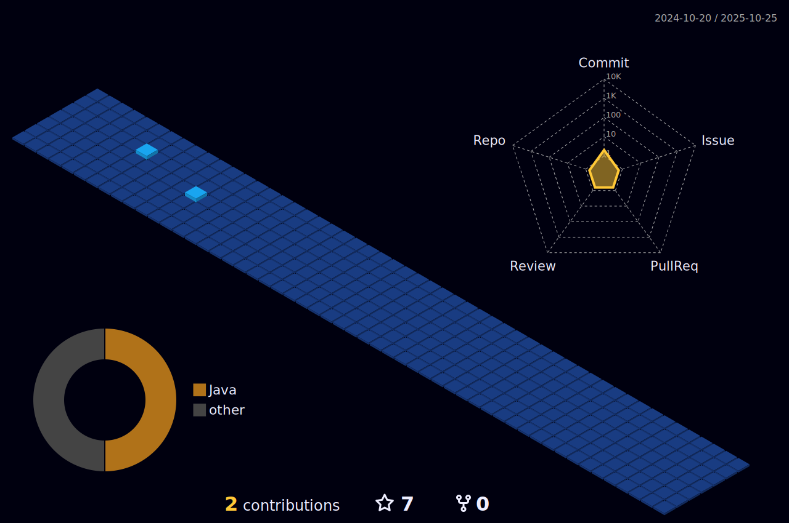

  

##

  
  

 

  <ul>
    <li><b>20 anos</b></li>
    <li><b>Cursando sistema de informação na UNINASSAU (2021 - 2024)</b></li>
    <li><b>Querendo seguir carreira de desenvolvedor Full-stack</b></li>
  </ul>

##

  
  

  
 

 
  
  
   

 

